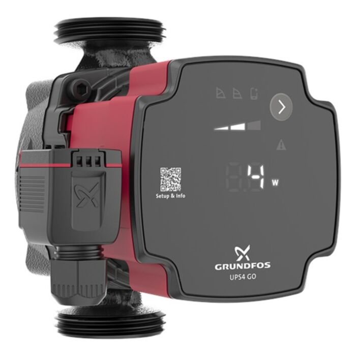

# Grundfos Alpha2 Go — Intégration HACS pour Home Assistant

Intégration Home Assistant pour le circulateur **Grundfos Alpha2 Go** via Bluetooth LE (protocole GENIbus).

---

## Capteurs exposés

| Capteur | Unité | Description |
|---|---|---|
| Débit | m³/h | Volume d'eau circulant |
| Hauteur manométrique | m | Pression générée (hauteur HMT) |
| Vitesse | RPM | Vitesse de rotation du rotor |
| Puissance | W | Consommation électrique |
| Tension | V | Tension d'alimentation |
| Intensité | A | Courant absorbé |

---

## Prérequis

- Home Assistant **2024.1+** avec Bluetooth activé (clé USB Bluetooth ou Raspberry Pi intégré)
- Pompe **Grundfos Alpha2 Go** couplée via l'application **GrundfosGo** puis découplée (la pompe ne peut maintenir qu'une connexion BLE à la fois)
- Python `bleak` (installé automatiquement)

> **Important :** La pompe ne supporte qu'**une seule connexion BLE simultanée**. Déconnectez votre téléphone de l'application avant qu'Home Assistant ne sonde la pompe.

---

## Installation via HACS

1. Dans HACS → **Intégrations** → menu ⋮ → **Dépôts personnalisés**
2. Ajoutez : `https://github.com/VOTRE_GITHUB/grundfos_alpha2go` — catégorie **Integration**
3. Installez **Grundfos Alpha2 Go**
4. Redémarrez Home Assistant

## Configuration

1. **Paramètres** → **Appareils & services** → **Ajouter une intégration**
2. Recherchez **Grundfos Alpha2 Go**
3. Sélectionnez la pompe détectée automatiquement **ou** saisissez son adresse MAC manuellement

### Trouver l'adresse MAC manuellement

- Dans l'application **GrundfosGo** → informations de la pompe
- Ou via `bluetoothctl scan on` sur le serveur HA

### Couplage initial

La pompe doit être **couplée** à Home Assistant :

1. Appuyez sur le **bouton de connectivité** (symbole Wi-Fi) de la pompe
2. Le voyant bleu clignote → connexion disponible
3. Lancez la configuration dans HA → la connexion s'établit automatiquement

---

## Architecture technique

```
Home Assistant
  └── grundfos_alpha2go (intégration HACS)
       ├── Alpha2GoCoordinator  (DataUpdateCoordinator, polling toutes les 30 s)
       ├── Alpha2GoClient       (connexion BLE via bleak)
       │    └── BLE GATT ──────────────────── Alpha2 Go
       │         Service  : 8e7f1a04-...      (GENIbus)
       │         TX char  : 8e7f1a06-...      (écriture requêtes)
       │         RX char  : 8e7f1a05-...      (notifications réponses)
       └── 6 × SensorEntity     (flow, head, speed, power, voltage, current)
```

### Protocole GENIbus sur BLE

La pompe utilise le protocole propriétaire **GENIbus** de Grundfos, encapsulé en GATT :

```
Trame requête :  [0x27] [LE] [0x20] [0x01] [0x02] [IDs...] [CS]
Trame réponse :  [0x27] [LE] [DA]   [SA]   [PDU]  [DATA..] [CS]
  PDU = 0x06 (données mesurées, standard Alpha3)
      | 0x30 (données étendues, observé sur Alpha2 Go)
```

---

## Dépannage

### La pompe n'apparaît pas dans la découverte automatique

- Vérifiez que le Bluetooth est activé dans HA (Paramètres → Système → Matériel)
- La pompe doit être à portée (≤ 10 m)
- Utilisez l'entrée manuelle avec l'adresse MAC

### Les valeurs sont `Indisponible`

- La pompe peut être déjà connectée à l'app mobile — fermez l'application
- Vérifiez les logs HA : `Paramètres → Système → Journaux → grundfos_alpha2go`

### PDU type inconnu (`Type 48` / `0x30`)

Ce type de réponse est typique des **Alpha2 Go et Alpha3 récents**. L'intégration tente de le décoder automatiquement. Si les valeurs semblent incorrectes :

1. Activez les logs DEBUG dans `configuration.yaml` :
   ```yaml
   logger:
     logs:
       custom_components.grundfos_alpha2go: debug
   ```
2. Ouvrez une [issue GitHub](https://github.com/VOTRE_GITHUB/grundfos_alpha2go/issues) avec les octets bruts

---

## Contribuer

Les contributions sont les bienvenues, notamment pour :
- Valider / affiner le décodage du PDU `0x30`
- Ajouter le contrôle de la pompe (changement de mode)
- Support d'autres modèles Grundfos (Magna3, etc.)

---

## Licences et remerciements

- Protocole BLE/GENIbus reverse-engineered depuis :
  - [ESPHome Alpha3 component](https://github.com/esphome/esphome/pull/3787) par [@jan-hofmeier](https://github.com/jan-hofmeier)
  - [openHAB Grundfos Alpha binding](https://www.openhab.org/addons/bindings/bluetooth.grundfosalpha/)
  - [AlphaDecoder](https://github.com/JsBergbau/AlphaDecoder) par [@JsBergbau](https://github.com/JsBergbau)
- Licence : MIT
